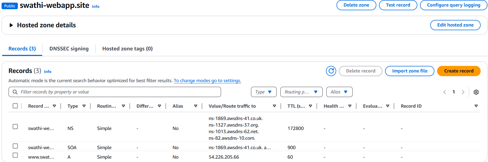

## End to end web deployment

#### Create VPC  
  


Now go to VPC settings - Enable DNS Hostnames - Save  


#### Create 4 subnets  


      
Created 2 public subnets in us east n.verginea 1a and 2 private subnets in u.s east n.verginea 1b

##### Enable public ip address to both public subnets: 

Select the my-vpc-public-subnet1- Actions- Edit subnet settings- select Enable auto-assign public IPv4 address. 


##### Create Route tables: 
I need two route tables; one is for private, and another is for public subnet. 
###### creating route table for public subnet:


##### Adding public subnets to the route table: 


###### Creating route table for private subnet:


##### Adding private subnets to the route table: 


##### Creating an Internet gateway:


##### Attach the created internet gateway to the VPC: 


##### Configuring internet gateway to the public subnet:  


***
#### Launch an Ec2 instance
     Name- My-Webapp 
     AMI- Ubuntu Server 24.04 LTS (HVM),EBS General Purpose (SSD) Volume Type
     Instance type- t2.micro
     key pair- choose the key pair
     Storage (volumes) 1 volume(s) - 8 GiB
###### Select the VPC and public subnet in Network settings:


###### Create the Security group:
<img src=".github/images/img_17.png" alt="configuring" width="50%"/
***
##### Connecting Ec2 instance using SSH
* Switch to root user:
````commandline
ubuntu@ip-11-0-7-135:~$ sudo su -
````
* Update the instance:
```commandline
root@ip-11-0-7-135:~# apt update 
```
* Install the web server
```commandline
root@ip-11-0-7-135:~# apt install apache2 
root@ip-11-0-7-135:~# systemctl start apache2  
root@ip-11-0-7-135:~# systemctl enable apache2  
```
* Install Git:
```commandline
root@ip-11-0-11-57:~# apt install git
```
* Connect the local machine to GitHub using an SSH key:
````commandline
root@ip-11-0-0-206:~# cd .ssh/
root@ip-11-0-0-206:~/.ssh# ls
authorized_keys
````
* Generate the SSH key pair (id_ed25519.pub), add the public key to
GitHub account
```commandline
root@ip-11-0-0-206:~/.ssh# ssh-keygen
root@ip-11-0-0-206:~/.ssh# ls
authorized_keys  id_ed25519 id_ed25519.pub
root@ip-11-0-0-206:~/.ssh# cat id_ed25519.pub
```
* Clone a repository using the SSH URL:
```commandline
root@ip-11-0-11-57:~# git clone git@github.com:Swathi971/Projects.git
```
* Go to Projects folder:
```commandline
root@ip-11-0-11-57:~# ls
Projects  snap
root@ip-11-0-11-57:~# cd Projects/
root@ip-11-0-11-57:~/Projects# git pull
root@ip-11-0-11-57:~/Projects# ls
AWS_Project  README.md  startbootstrap-agency-gh-pages.zip
```
* Install the unzip package using Ubuntu's package manager (apt):
```commandline
root@ip-11-0-11-57:~/Projects# apt install unzip
```
*  Extract the contents of the file startbootstrap-agency-gh-pages.zip into the current directory:
```commandline
root@ip-11-0-11-57:~/Projects# unzip startbootstrap-agency-gh-pages.zip
```
* The folder startbootstrap-agency-gh-pages is the extracted source code of an application.
```commandline
root@ip-11-0-11-57:~/Projects# ls
AWS_Project  README.md  startbootstrap-agency-gh-pages  startbootstrap-agency-gh-pages.zip
```
* To rename that folder to MyWebApp, use this command:
```commandline
root@ip-11-0-11-57:~/Projects# mv startbootstrap-agency-gh-pages MyWebApp
```
* After renaming, our directory will look like:
```commandline
root@ip-11-0-11-57:~/Projects# ls
AWS_Project  MyWebApp  README.md  startbootstrap-agency-gh-pages.zip
```
* Go inside the renamed application folder MyWebApp, and it contains the following:
```commandline
root@ip-11-0-11-57:~/Projects# cd MyWebApp
root@ip-11-0-11-57:~/Projects/MyWebApp# ls
assets  css  index.html  js
```
  index.html is the main source code file for a static website.
##### Apache2 Default Directory:
* Apache2 serves web content from:
```commandline
/var/www/html/
```
##### This lists all files in the Apache default web root directory:
```commandline
ls -la /var/www/html/
```
##### Current Apache Page
   The file /var/www/html/index.html is the default Apache welcome page.
##### This shows the current path where the application (source code) is located:
```commandline
pwd
# Output: /root/Demo/mywebapp
```
* To make the app accessible through a web browser, I need to copy all its contents to Apache's default web directory:
```commandline
/var/www/html
```
##### Deploy App
   To show the app in the browser:
*  Delete the existing index.html in /var/www/html/
```commandline
rm /var/www/html/index.html
```
*  Moves all files and folders from the current directory to the /var/www/html/ directory:
```commandline
 mv ./* /var/www/html/
```
  This is used to deploy the web application by moving its source files (like index.html, css/, js/) to the Apache server's default folder, so they become accessible in a browser.
##### Result:
  Now, when you access your EC2 public IP in the browser, it will load your application.

____
##### Accessing App via Domain Instead of IP
  Steps to use a custom domain:
1. Buy a Domain name from Hostinger
2. Create a hosted zone

3. Update DNS Settings:

   Create an A record:
```commandline
   Name: www
   Type: A
   Value: your EC2 public IP
```


##### Access the App:
   Now http://www.swathi-webapp.site can be opened in the browser.


