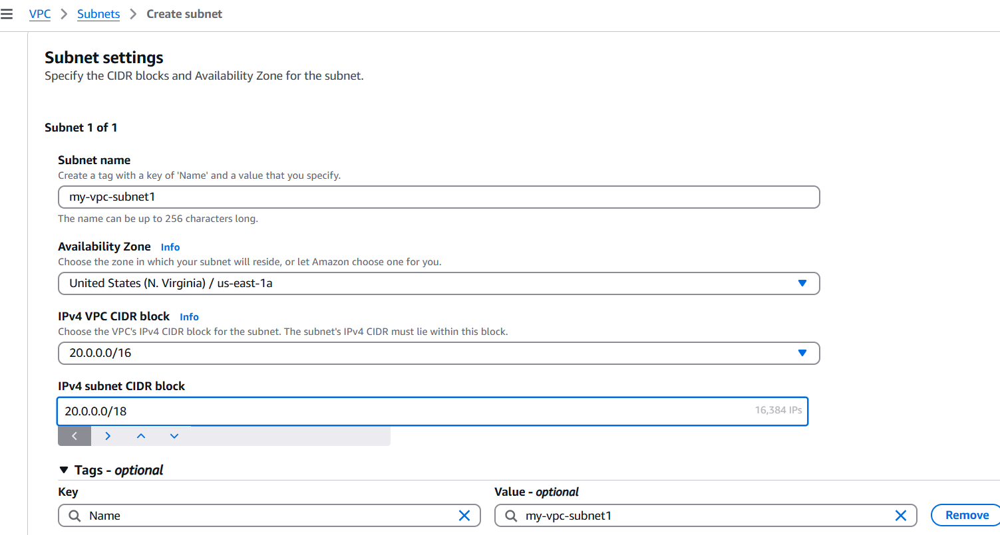

## End to end web deployment

#### Create VPC  
  

Now go to VPC settings - Enable DNS Hostnames - Save  

#### Create 4 subnets  

      
Created 2 public subnets in us east n.verginea 1a and 2 private subnets in u.s east n.verginea 1b

##### Enable public ip address to both public subnets: 

Select the my-vpc-public-subnet1- Actions- Edit subnet settings- select Enable auto-assign public IPv4 address. 

