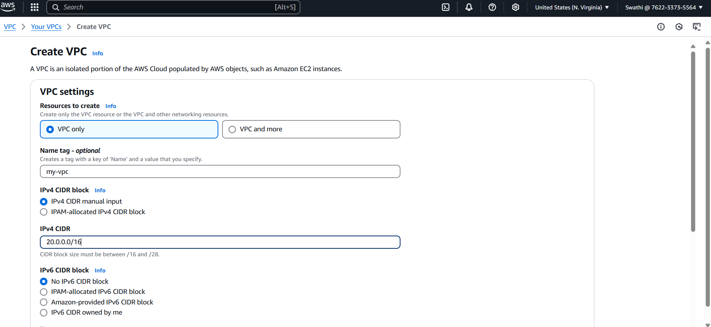

## End to end web deployment
#### Create VPC

   Now go to VPC settings- Enable DNS Hostnames- Save

#### Create 4 subnets

Created 2 public subnets in us east n.verginea 1a and 2 private subnets in u.s east n.verginea 1b

