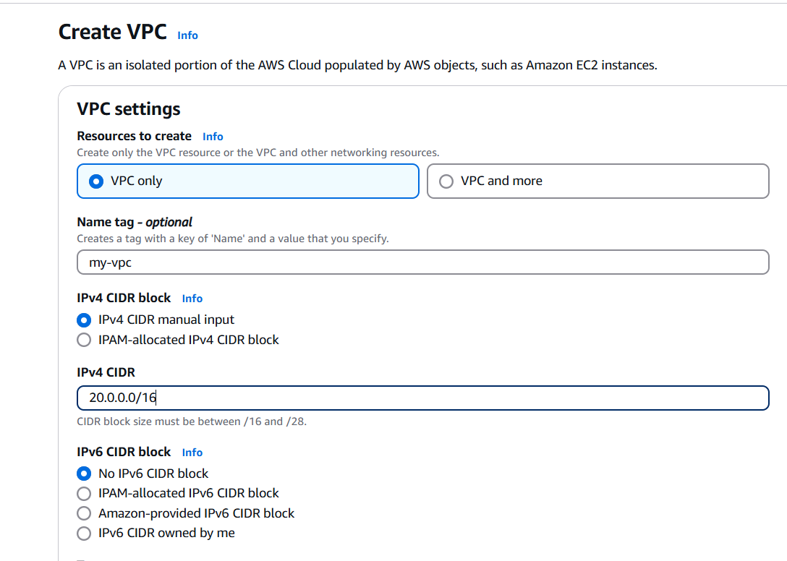
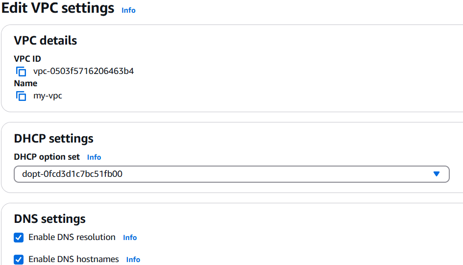
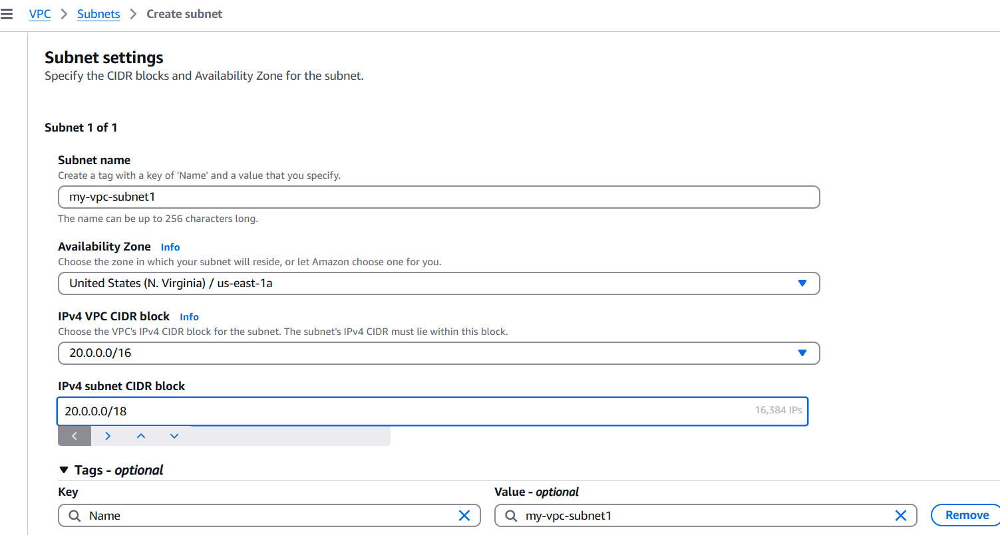
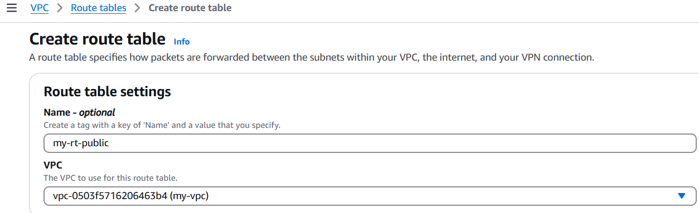
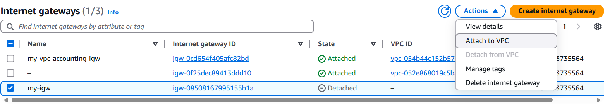
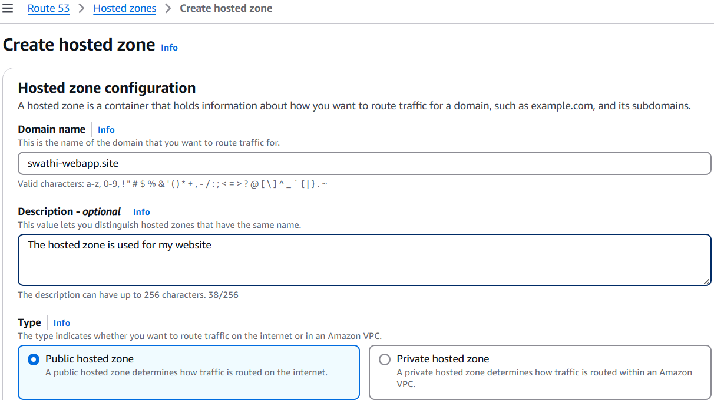
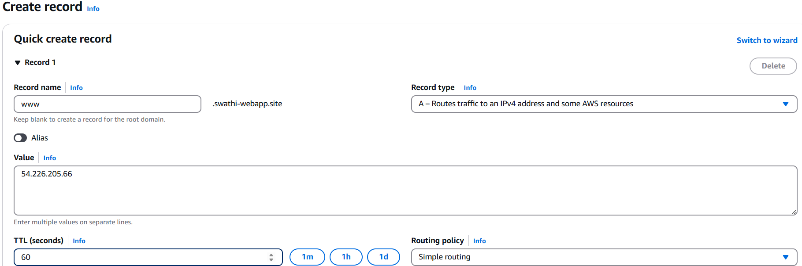

## End-to-End Static Website Deployment on AWS EC2 Using Apache and GitHub

#### Project Goal:
Deploy a static website on an AWS EC2 instance, using Apache web server, and host the code in GitHub for version control. 
### Create VPC
  

**Enable DNS Hostnames**:


### Create 4 subnets  
* Create 2 public subnets in US East N.Verginea 1a and 2 private subnets in US N.Verginea 1b:


#### Enable public IP address to both public subnets: 
* Select the my-vpc→public-subnet1→ Actions→ Edit subnet settings→ select Enable auto-assign public IPv4 address. 


##### Create Route tables: 
* Two route tables are needed; one is for private, and another is for public subnet. 
##### creating route table for public subnet:



##### Adding public subnets to the route table: 


##### Creating route table for private subnet:


##### Adding private subnets to the route table: 


##### Creating an Internet gateway:


##### Attach the created internet gateway to the VPC: 



##### Configuring internet gateway to the public subnet:  


***
#### Launch Ec2 instance
     Name- My-Webapp 
     AMI- Ubuntu Server 24.04 LTS (HVM),EBS General Purpose (SSD) Volume Type
     Instance type- t2.micro
     key pair- choose the key pair
     Storage (volumes) 1 volume(s) - 8 GiB
##### Select the VPC and public subnet in Network settings:


##### Create the Security group:


***

##### Connecting Ec2 instance using SSH:
* Used MobaXterm (PuTTY or terminal can be used) to connect. 
##### Switch to root user:
````commandline
sudo su -
````
##### Install Required Packages:
* Updated packages:
```commandline
apt update 
```
* Install Apache:
```commandline
apt install apache2 
```
* Start the apache web server:
```
systemctl start apache2  
```
* Enable the Apache server to start automatically on system boot:
```commandline
systemctl enable apache2
```
Confirm if Apache is running or not:
```commandline
systemctl status apache2 
```
* Install Git:
```commandline
apt install git
```
* Install unzip tools:
```commandline
apt install unzip
```
#####  Configure GitHub SSH Access:
* Connect the local machine to GitHub using an SSH key. Now generate the SSH key pair (id_ed25519.pub):
````commandline
cd .ssh/  
ssh-keygen 
````
* Add the public key to GitHub → Settings → SSH and GPG keys.
* Clone a repository using the SSH URL:
```commandline
git clone git@github.com:Swathi971/Projects.git 
```
##### Deploy the Website:
* Move into the cloned Projects folder:
```commandline
cd Projects/
```
* Updates the local repo with the latest changes from GitHub:
```commandline
git pull
```
* Unzip the project template means extracting the contents of the file startbootstrap-agency-gh-pages.zip into the current directory:
```commandline
unzip startbootstrap-agency-gh-pages.zip  
```
* The folder startbootstrap-agency-gh-pages is the extracted source code of an application:
```commandline
startbootstrap-agency-gh-pages
```
* Rename the folder for clarity:
```commandline
mv startbootstrap-agency-gh-pages MyWebApp
```
* MyWebApp application folder contains the following:
```commandline
assets
css  
index.html  
js
```
##### Apache2 Default Directory:
* Apache2 serves web content from:
```commandline
/var/www/html/
```
* Removed the default index.html: 
```commandline
rm /var/www/html/index.html 
```
* Moved the source code to Apache’s root: 
```commandline
mv ./* /var/www/html/
```
##### Access the Website: 
 * In a browser, visit: 
```commandline
http://<EC2-public-IP>
``` 
* Website is live!
##### Result:
  Now, when you access your EC2 public IP in the browser, it will load your application.

____
##### Accessing App via Domain Instead of IP
  Steps to use a custom domain:
1. Buy a Domain name from Hostinger
2. Create a hosted zone


3. Update DNS Settings:
*  Create an A record:
```commandline
   Name: www
   Type: A
   Value: your EC2 public IP
```




##### Access the App:
* Now the site is accessible at:  http://www.swathi-webapp.site 
##### Summary:
I deployed a static website on AWS EC2 using Apache. I cloned the code from GitHub using SSH, configured the Apache web root, and optionally connected a domain. This project showed my ability to manage cloud resources, web servers, Git, and secure access. 


