## CI pipeline for a Java application/ Continuous integration of a Java application
### 🔧 Tools Used
* **AWS EC2** – Hosting Jenkins, SonarQube, and Docker 
* **Git & GitHub** – Source code version control 
* **Jenkins** – CI pipeline automation 
* **Java (JDK 17)** – Application development 
* **Apache Maven** – Build and dependency management 
* **SonarQube** – Code quality analysis 
* **Docker** – Containerization 
* **Apache Tomcat** – Application server 
* **Trivy** – Docker image vulnerability scanning 
* **Docker Hub** – Image repository

### 1. EC2 Instance Setup (Admin Server)
* Instance name: admin-server 
* AMI: Ubuntu 
* Instance type: t2.medium 
* Storage: 20 GB 
* Hostname:
```commandline
root@ip-178-65-34-123:~# hostname admin-server
```
[Jenkins setup](https://www.jenkins.io/doc/book/installing/linux/)

### 2. Install Java & Jenkins
#### Script to install Java 17 and Jenkins
```commandline
sudo apt update
sudo apt install openjdk-17-jdk -y
java -version
```
#### Jenkins installation
```commandline
sudo wget -O /etc/apt/keyrings/jenkins-keyring.asc \
  https://pkg.jenkins.io/debian-stable/jenkins.io-2023.key
echo "deb [signed-by=/etc/apt/keyrings/jenkins-keyring.asc]" \
  https://pkg.jenkins.io/debian-stable binary/ | sudo tee \
  /etc/apt/sources.list.d/jenkins.list > /dev/null
sudo apt update
sudo apt install jenkins
sudo systemctl enable jenkins
sudo systemctl start jenkins
sudo systemctl status jenkins
```
```commandline
root@admin-server:~# vi script.sh
```

#### Access Jenkins
* Open browser → ```http://<Public-IP>:8080```
* Unlock Jenkins using:
```commandline
cat /var/lib/jenkins/secrets/initialAdminPassword
```
### 3. SonarQube Installation
#### Create SonarQube user
```commandline
root@admin-server:~# adduser sonarqube  
root@admin-server:~# apt install unzip -y
root@admin-server:~# su – sonarqube 
```
#### Download & start SonarQube
```commandline
sonarqube@admin-server:~ wget https://binaries.sonarsource.com/Distribution/sonarqube/sonarqube-9.4.0.54424.zip
sonarqube@admin-server:~$ unzip * 
sonarqube@admin-server:~$ ls 
sonarqube-9.4.0.54424.zip sonarqube-9.4.0.54424 
sonarqube@admin-server:~$ chmod -R 755 /home/sonarqube/sonarqube-9.4.0.54424 
sonarqube@admin-server:~$ chown -R sonarqube:sonarqube /home/sonarqube/sonarqube-9.4.0.54424 
sonarqube@admin-server:~$ cd sonarqube-9.4.0.54424/bin/linux-x86-64/ 
sonarqube@admin-server:~/sonarqube-9.4.0.54424/bin/linux-x86-64$ ./sonar.sh start 
Starting SonarQube... 
Started SonarQube. 
```
* Port: 9000 (open in security group)
* Login: admin / admin → old password is admin, change password to ```1234```
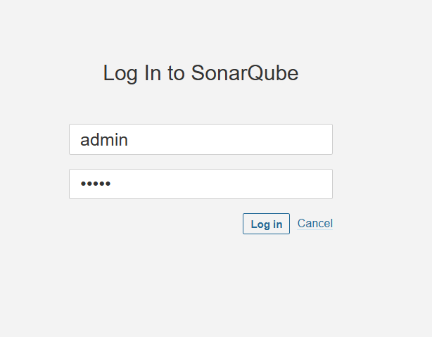

### 4. Install Docker
```commandline
root@admin-server:~# vi docker.sh
```
```commandline
#!/bin/bash
echo << EOF
"=========================================================="
"||     Set up Docker's Apt repository ...............   ||"
"=========================================================="
EOF
#Set up Docker's Apt repository
# Add Docker's official GPG key:
sudo apt-get update -y
sudo apt-get install ca-certificates curl gnupg -y
sudo install -m 0755 -d /etc/apt/keyrings
curl -fsSL https://download.docker.com/linux/ubuntu/gpg | sudo gpg --dearmor -o /etc/apt/keyrings/docker.gpg
sudo chmod a+r /etc/apt/keyrings/docker.gpg

# Add the repository to Apt sources:
echo \
  "deb [arch="$(dpkg --print-architecture)" signed-by=/etc/apt/keyrings/docker.gpg] https://download.docker.com/linux/ubuntu \
  "$(. /etc/os-release && echo "$VERSION_CODENAME")" stable" | \
  sudo tee /etc/apt/sources.list.d/docker.list > /dev/null
sudo apt-get update -y

echo << EOF
"=========================================================="
"||   Docker's Apt repository is completed...........    ||"
"=========================================================="
EOF


echo << EOF
"=========================================================="
"||   Install the Docker packages....................    ||"
"=========================================================="
EOF

sudo apt-get install docker-ce docker-ce-cli containerd.io docker-buildx-plugin docker-compose-plugin -y

echo << EOF
"=========================================================="
"||   Install is completed ....................    ||"
"=========================================================="
EOF

dockerStatus=$(systemctl status docker | awk '/Active/ {print $3}' | tr -d "[()]")
dockerVersion=$(docker -v | awk '/version/ {print $3}' | tr -d ",")

echo "The Docker status is $dockerStatus"
echo "The Docker version is $dockerVersion"
```
```commandline
root@admin-server:~# sh docker.sh 
```
### 5. Trivy Installation (Image Scanning)
[Trivy Installation](https://trivy.dev/docs/v0.61/getting-started/installation/#__tabbed_2_2)

```commandline
wget https://github.com/aquasecurity/trivy/releases/download/v0.61.1/trivy_0.61.1_Linux-64bit.deb 
sudo dpkg -i trivy_0.61.1_Linux-64bit.deb 
```
### 6. Jenkins Tool Configuration
#### Install Plugins
* Eclipse Temurin Installer 
* Pipeline Stage View

#### Configure Tools
Manage Jenkins → Tools
* JDK: Java 17 (Adoptium)
* Maven: Name = ```maven```

### 7. SonarQube Integration with Jenkins
#### Create SonarQube Token
* SonarQube → My Account → Security → Generate Token
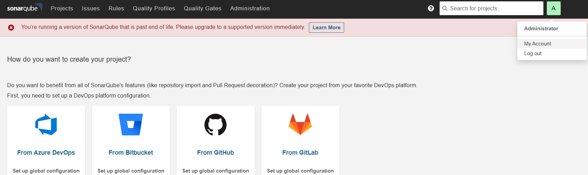


#### Add Jenkins Credential
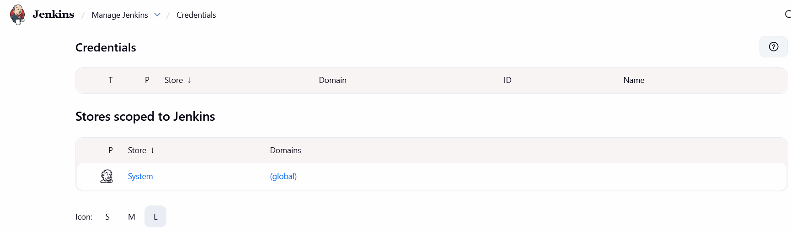


* Type: Secret Text 
* ID: ```sonarqube``` 
* Value: Token

### 8. Docker Permission for Jenkins
```commandline
root@admin-server:~# cat /etc/group
```
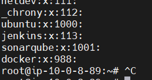

```commandline
root@admin-server:~# usermod  -aG docker jenkins
root@admin-server:~# usermod  -aG docker ubuntu 
root@admin-server:~# cat /etc/group | tail 
Docker:x:988;jenkins,ubuntu
root@admin-server:~# systemctl restart docker 
root@admin-server:~# systemctl status docker 
```
### 9. Docker Hub Credentials
#### Create Docker Hub Access Token
* Docker Hub → Account Settings → Security 
* Token name: ```cli``` 
* Permissions: Read, Write, Delete
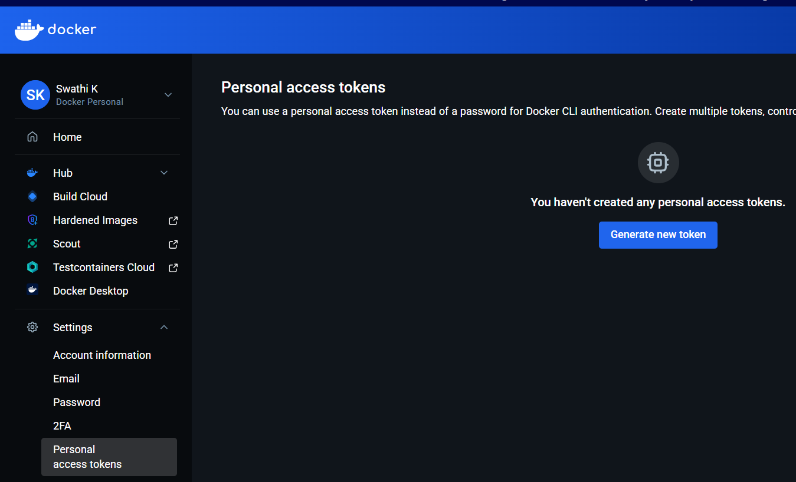

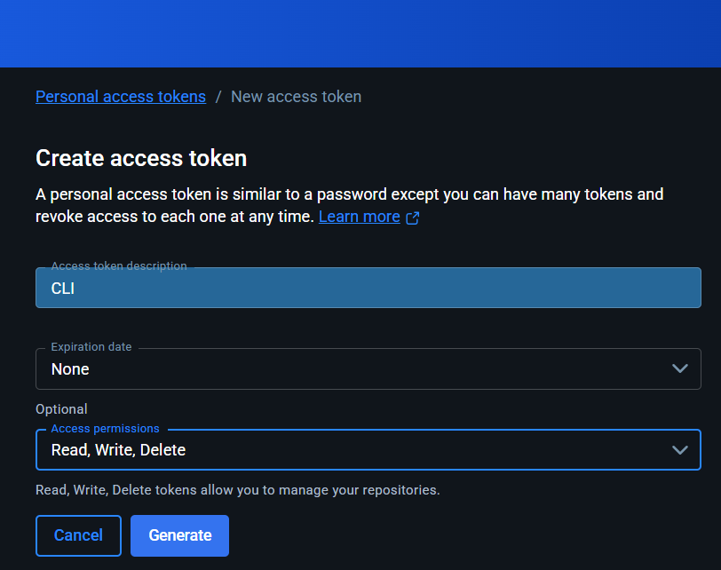

#### Add Jenkins Credential
* Type: Username & Password 
* ID: ```docker-hub-credentials```
* Username: ```swathi971``` 
* Password: Access Token

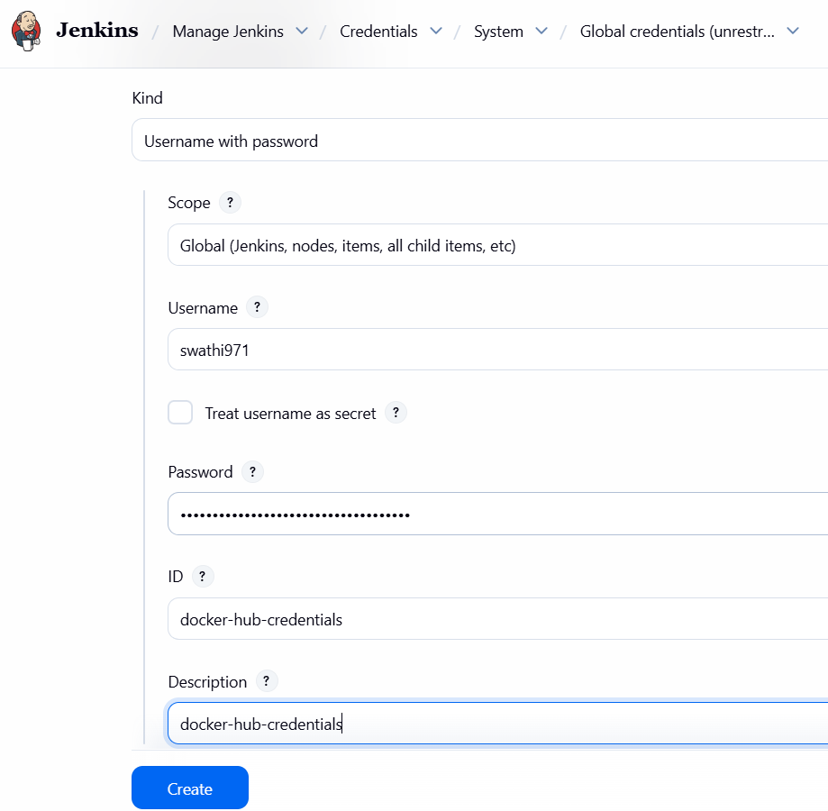

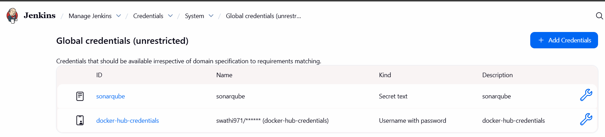

### 10. Jenkins Pipeline Job Creation & Build Issue Resolution
#### a) Push Jenkinsfile & Dockerfile from VS Code
* Create a new Jenkinsfile & Dockerfile in VS Code 
* Commit and push it to GitHub repository (```test-1```)
* Put the sonarQube URL in codescan stage

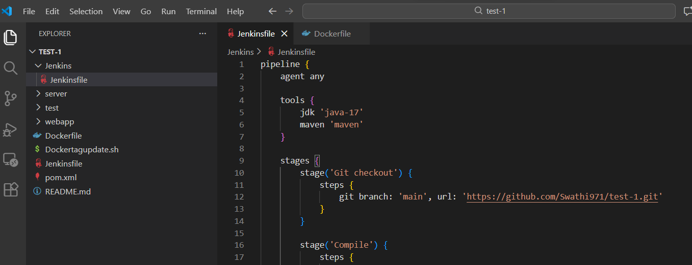

#### b) Create Jenkins Pipeline Job
1. Open Jenkins Dashboard
2. Click New Item
3. Enter:
   * Job name: project-1-continuous-integration 
   * Type: Pipeline
4. Click OK

#### c) Configure Pipeline from SCM


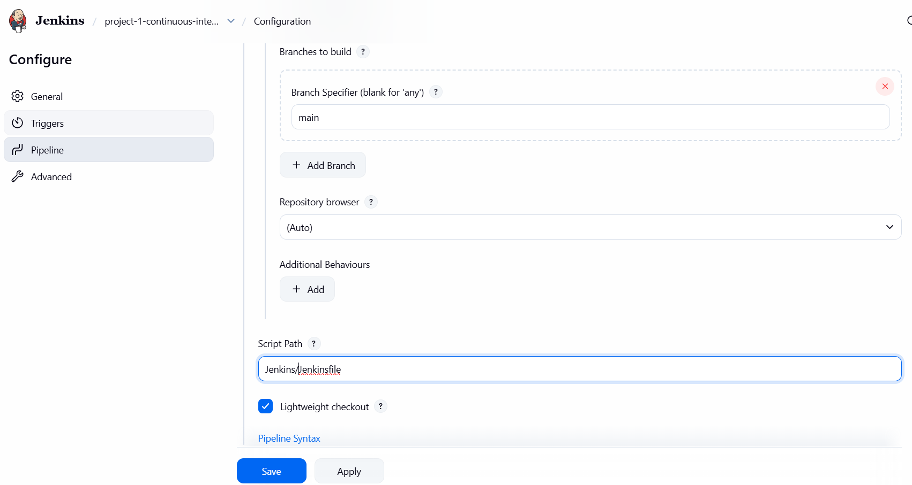

#### d) Errors
* ##### Failure in the codescan (SonarQube) stage
```commandline
No plugin found for prefix 'sonar'
```
This means:

* SonarQube Maven plugin is NOT configured 
* Jenkins is running:  `mvn sonar:sonar` 

but Maven does not know what `sonar` is

##### Solution:

Use fully qualified Sonar plugin instead of `sonar:sonar`

##### Replace this:
```commandline
mvn sonar:sonar \
-Dsonar.login=$SONAR_AUTH_TOKEN \
-Dsonar.host.url=http://44.203.87.237:9000/
```
##### With this
```commandline
mvn org.sonarsource.scanner.maven:sonar-maven-plugin:sonar \
-Dsonar.login=$SONAR_AUTH_TOKEN \
-Dsonar.host.url=http://44.203.87.237:9000/
```
##### Jenkins warning:
I saw `Warning: A secret was passed using Groovy String interpolation`

This is bad because secrets may appear in logs.

##### Correct Jenkins way:
```commandline
sh '''
mvn org.sonarsource.scanner.maven:sonar-maven-plugin:sonar \
-Dsonar.login=$SONAR_AUTH_TOKEN \
-Dsonar.host.url=http://44.203.87.237:9000/
'''
```
The pipeline failed at SonarQube stage because the Sonar Maven plugin was not explicitly defined.
I fixed it by using the fully qualified Sonar Maven plugin command, which is a best practice in Jenkins pipelines to avoid pom dependency changes.

* #### Maven pom.xml Issue – How I Solved It
##### Why the error occurred:
The build failed because the project was using Java 1.6 and an old Maven compiler plugin (2.3.2), while Jenkins was running with Java 17. This Java version mismatch caused Maven compilation to fail.

##### 🔍 Root Cause Analysis
##### 1️. Existing Configuration (Wrong)
##### Parent pom.xml
```commandline
<plugin>
  <artifactId>maven-compiler-plugin</artifactId>
  <configuration>
    <source>1.6</source>
    <target>1.6</target>
  </configuration>
</plugin>
```
##### pluginManagement
```commandline
<plugin>
  <artifactId>maven-compiler-plugin</artifactId>
  <version>2.3.2</version>
</plugin>
```
##### Jenkins Configuration
* Jenkins JDK: Java 17 
* Maven compiler plugin 2.3.2 does not support Java 11/17

##### Solution:
##### Step 1: Remove Old Compiler Plugin
Removed the outdated plugin configuration using Java 1.6.

##### Step 2: Add Correct Maven Compiler Plugin
Added a modern compiler plugin compatible with Java 17.
```commandline
<plugin>
  <groupId>org.apache.maven.plugins</groupId>
  <artifactId>maven-compiler-plugin</artifactId>
  <version>3.11.0</version>
  <configuration>
    <source>17</source>
    <target>17</target>
  </configuration>
</plugin>
```
##### Step 3: Fix `pluginManagement`
Updated the compiler plugin version so all child modules use the correct version.
```commandline
<plugin>
  <artifactId>maven-compiler-plugin</artifactId>
  <version>3.11.0</version>
</plugin>
```
I removed the old compiler plugin configuration, upgraded the maven-compiler-plugin to version 3.11.0, and updated the source and target to Java 17 in both <build> and <pluginManagement> sections. After aligning the Java versions, the build succeeded.

* #### SonarQube Startup Issue – Root Cause and Resolution
##### Issue: 
SonarQube failed to start when accessed through the public IP on port 9000.

##### Root Cause:

SonarQube internally uses Elasticsearch, which requires sufficient system memory and supports only Java 11 or Java 17. Initially, the EC2 instance had limited resources, and the system was running Java 21, which is not supported by SonarQube 9.4. Due to this Java version mismatch and memory constraints, the SonarQube service could not start.

##### Resolution:

To fix the issue, I upgraded the EC2 instance to t2.medium to meet Elasticsearch memory requirements. Then, I installed OpenJDK 17 and explicitly configured the system to use Java 17 using `update-alternatives`. After aligning the Java version with SonarQube’s requirements, I restarted the SonarQube service, and it started successfully. The SonarQube dashboard became accessible via public IP:9000.

* #### Build Failure: Permission Denied (Docker Build & Tag)
During Build and Tag stage:
```commandline
permission denied while trying to connect to the Docker daemon
```
##### Root Cause
* Docker permissions were assigned to Jenkins user 
* Jenkins service was not restarted 
* Hence Jenkins could not access Docker socket

#### Fix: Restart Jenkins
##### Restart Jenkins via browser
```commandline
http://<EC2-IP>:8080/restart
```
#### Verify Jenkins Admin Password (If Login Required Again)
```commandline
cd /var/lib/jenkins/secrets
cat initialAdminPassword
```
* Username: admin 
* Password: (copied value)

* #### Error in stage pushing image to repository:
```commandline
root@ip-10-0-19-162:/# docker push swathi971/webapp:1
The push refers to repository [docker.io/swathi971/webapp]
20043066d3d5: Waiting
05624b880a51: Waiting
378e3a6f165e: Waiting
841c6b2bc7ed: Waiting
45e2e3388eeb: Waiting
9be852926522: Waiting
ff4b6af59d8f: Waiting
627c55a201a9: Waiting
4f4fb700ef54: Waiting
901b8cfcfda7: Waiting
authentication required - access token has insufficient scopes
```
##### solution:
I was using a Docker Hub token with READ-ONLY scope
I need to allow access permission as read, write and delete in Dockerhub while generating the token.
##### Step 1: Completely reset Docker login
On the Jenkins server:
```commandline
docker logout
```
##### Step 2: Create a NEW Docker Hub Access Token
On Docker Hub website:
* Login to Docker Hub
* Click profile → Account Settings 
* Go to Security 
* Click New Access Token 
* Name: jenkins-push 
* Permissions: Read, Write, Delete 
* Copy the token (VERY IMPORTANT)

⚠️ Do NOT use an old token

##### Step 3: Login manually using the token
On Jenkins server terminal:
```commandline
docker login -u swathi971
```
When it asks for password:

👉 PASTE THE ACCESS TOKEN (not Docker password)

Expected output:
```commandline
Login Succeeded
```
I debugged a Docker push failure caused by insufficient token scopes.
I resolved it by regenerating a Docker Hub access token with write, read and delete permissions and validating authentication directly on the Jenkins host.

* #### Wrong Docker Hub credentials in Jenkins
Even one character mismatch causes this.
* Go to Jenkins → Manage Jenkins → Credentials 
* Open docker-hub-credentials 
* Verify:
   * Username: swathi971 
   * Password:
  
     👉 Either your Docker Hub password
  
     👉 OR Access Token (recommended)

🔹 If unsure → delete and recreate the credential.

_I have updated the credentials by changing the password to token._

#### Docker Hub Manual Login (Token-Based)
##### Login using Docker Hub Access Token
```commandline
docker login -u swathi971
```
When prompted for password:

👉 PASTE DOCKER HUB ACCESS TOKEN (NOT Docker Hub password)

##### Expected Output
```commandline
Login Succeeded
```
_You dont need to login manually. If error appears follow these steps. Otherwise Jenkins automatically login to Dockerhub._
### 11. Dockerfile (Tomcat Deployment)
```commandline
FROM tomcat:latest
RUN cp -r /usr/local/tomcat/webapps.dist /usr/local/tomcat/webapps
COPY webapp/target/webapp.war /usr/local/tomcat/webapps
```

### 12. Jenkinsfile (CI Pipeline)
```commandline
pipeline {
    agent any

    tools {
        jdk 'java-17'
        maven 'maven'
    }

    stages {
        stage('Git checkout') {
            steps {
                git branch: 'main', url: 'https://github.com/Swathi971/test-1.git'
            }
        }

        stage('Compile') {
            steps {
                sh "mvn compile"
            }
        }

        stage('Build') {
            steps {
                sh "mvn clean install"
            }
        }

       stage('codescan') {
    steps {
        withCredentials([string(credentialsId: 'sonarqube', variable: 'SONAR_AUTH_TOKEN')]) {
            sh '''
                mvn org.sonarsource.scanner.maven:sonar-maven-plugin:sonar \
                -Dsonar.login=$SONAR_AUTH_TOKEN \
                -Dsonar.host.url=http://44.202.152.245:9000/
            '''
            }
           }
       }


        stage('Build and tag') {
            steps {
                sh "docker build -t swathi971/webapp:1 ."
            }
        }

        stage('Docker image scan') {
            steps {
                sh "trivy image --format table -o trivy-image-report.html swathi971/webapp:1"
            }
        }

        stage('Containersation') {
            steps {
                sh '''
                    docker stop c2 || true
                    docker rm c2 || true
                    docker run -it -d --name c2 -p 9003:8080 swathi971/webapp:1
                '''
            }
        }

        stage('Login to Docker Hub') {
            steps {
                script {
                    withCredentials([usernamePassword(credentialsId: 'docker-hub-credentials', usernameVariable: 'DOCKER_USERNAME', passwordVariable: 'DOCKER_PASSWORD')]) {
                        sh "echo $DOCKER_PASSWORD | docker login -u $DOCKER_USERNAME --password-stdin"
                    }
                }
            }
        }

        stage('Pushing image to repository') {
            steps {
                sh 'docker push swathi971/webapp:1'
            }
        }
    }
}
```
### 13. Parent pom.xml
```commandline
<project xmlns="http://maven.apache.org/POM/4.0.0" xmlns:xsi="http://www.w3.org/2001/XMLSchema-instance"
         xsi:schemaLocation="http://maven.apache.org/POM/4.0.0 http://maven.apache.org/maven-v4_0_0.xsd">

  <modelVersion>4.0.0</modelVersion> 

  <groupId>com.example.maven-project</groupId>
  <artifactId>maven-project</artifactId>
  <packaging>pom</packaging>
  <version>1.0-SNAPSHOT</version>
  <name>Maven Project</name>
  <description>Sample Maven project with a working, deployable site.</description>
  <url>http://www.example.com</url>
 
  <properties>
    <project.build.sourceEncoding>utf-8</project.build.sourceEncoding>
    <project.reporting.outputEncoding>utf-8</project.reporting.outputEncoding>
  </properties>

  <modules>
    <module>server</module>
    <module>webapp</module>
  </modules>

  <distributionManagement>
    <site>
      <id>site-server</id>
      <name>Test Project Site</name>
      <url>file:///tmp/maven-project-site</url>
    </site>
  </distributionManagement>

  <build>
    <plugins>
      <plugin>
     <groupId>org.apache.maven.plugins</groupId>
  <artifactId>maven-compiler-plugin</artifactId>
  <version>3.11.0</version>
  <configuration>
      <source>17</source>
      <target>17</target>
      </configuration>
    </plugin>


      <plugin>
        <artifactId>maven-release-plugin</artifactId>
        <configuration>
          <autoVersionSubmodules>true</autoVersionSubmodules>
        </configuration>
      </plugin>

      <plugin>
        <artifactId>maven-site-plugin</artifactId>
        <configuration>
          <reportPlugins>
            <plugin>
              <artifactId>maven-checkstyle-plugin</artifactId>
            </plugin>

            <plugin>
              <artifactId>maven-jxr-plugin</artifactId>
            </plugin>

            <plugin>
              <artifactId>maven-javadoc-plugin</artifactId>
            </plugin>

            <plugin>
              <artifactId>maven-pmd-plugin</artifactId>
            </plugin>

            <plugin>
              <artifactId>maven-surefire-report-plugin</artifactId>
            </plugin>

            <plugin>
              <groupId>org.codehaus.mojo</groupId>
              <artifactId>findbugs-maven-plugin</artifactId>
            </plugin>

            <plugin>
              <groupId>org.codehaus.mojo</groupId>
              <artifactId>taglist-maven-plugin</artifactId>
            </plugin>
          </reportPlugins>
        </configuration>
      </plugin>
    </plugins>

    <pluginManagement>
      <plugins>
        <plugin>
          <artifactId>maven-checkstyle-plugin</artifactId>
          <version>2.8</version>
        </plugin>

        <plugin>
          <artifactId>maven-compiler-plugin</artifactId>
          <version>3.11.0</version>
        </plugin>

        <plugin>
          <artifactId>maven-javadoc-plugin</artifactId>
          <version>2.8</version>
        </plugin>

        <plugin>
          <artifactId>maven-jxr-plugin</artifactId>
          <version>2.3</version>
        </plugin>

        <plugin>
          <artifactId>maven-pmd-plugin</artifactId>
          <version>2.6</version>
        </plugin>

        <plugin>
          <artifactId>maven-project-info-reports-plugin</artifactId>
          <version>2.4</version>
        </plugin>

        <plugin>
          <artifactId>maven-release-plugin</artifactId>
          <version>2.2.1</version>
        </plugin>

        <plugin>
          <artifactId>maven-resources-plugin</artifactId>
          <version>2.5</version>
        </plugin>

        <plugin>
          <artifactId>maven-site-plugin</artifactId>
          <version>3.0</version>
        </plugin>

        <plugin>
          <artifactId>maven-surefire-report-plugin</artifactId>
          <version>2.11</version>
        </plugin>

        <plugin>
          <artifactId>maven-surefire-plugin</artifactId>
          <version>2.11</version>
        </plugin>

        <plugin>
          <groupId>org.codehaus.mojo</groupId>
          <artifactId>findbugs-maven-plugin</artifactId>
          <version>2.3.3</version>
        </plugin>

        <plugin>
          <groupId>org.codehaus.mojo</groupId>
          <artifactId>taglist-maven-plugin</artifactId>
          <version>2.4</version>
        </plugin>

        <plugin>
          <groupId>org.mortbay.jetty</groupId>
          <artifactId>jetty-maven-plugin</artifactId>
          <version>8.0.0.M1</version>
        </plugin>
      </plugins>
    </pluginManagement>
  </build>

  <dependencyManagement>
    <dependencies>
      <dependency>
        <groupId>javax.servlet</groupId>
        <artifactId>servlet-api</artifactId>
        <version>2.5</version>
      </dependency>

      <dependency>
        <groupId>javax.servlet.jsp</groupId>
        <artifactId>jsp-api</artifactId>
        <version>2.2</version>
      </dependency>

      <dependency>
        <groupId>junit</groupId>
        <artifactId>junit-dep</artifactId>
        <version>4.10</version>
        <scope>test</scope>
      </dependency>

      <dependency>
        <groupId>org.hamcrest</groupId>
        <artifactId>hamcrest-core</artifactId>
        <version>1.2.1</version>
        <scope>test</scope>
      </dependency>

      <dependency>
        <groupId>org.hamcrest</groupId>
        <artifactId>hamcrest-library</artifactId>
        <version>1.2.1</version>
        <scope>test</scope>
      </dependency>

      <dependency>
        <groupId>org.mockito</groupId>
        <artifactId>mockito-core</artifactId>
        <version>1.8.5</version>
        <scope>test</scope>
      </dependency>
    </dependencies>
  </dependencyManagement>

  <scm>
    <connection>scm:git:git@github.com:jleetutorial/maven-project.git</connection>
    <developerConnection>scm:git:git@github.com:jleetutorial/maven-project.git</developerConnection>
    <tag>HEAD</tag>
    <url>http://github.com/jleetutorial/maven-project</url>
  </scm>

  <prerequisites>
    <maven>3.0.3</maven>
  </prerequisites>

</project>
```
### Final Expected Outputs


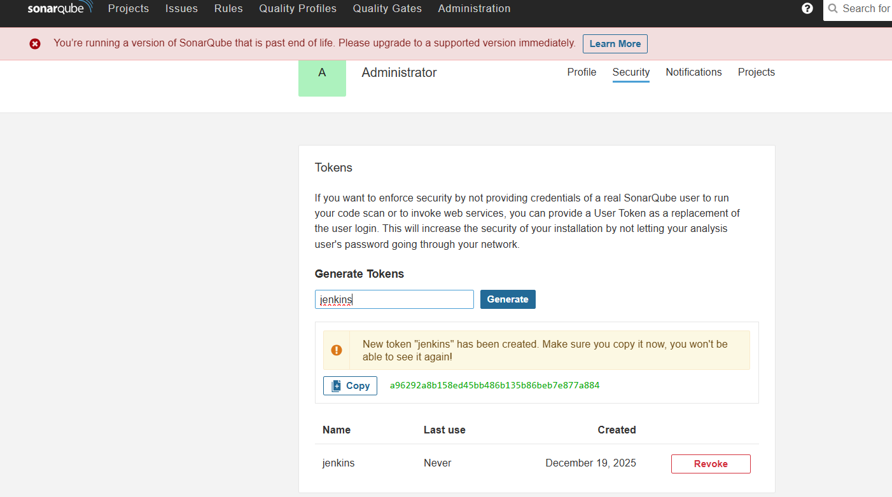

* **Jenkins Pipeline**: SUCCESS 
* **SonarQub**e: Code quality report visible 
* Docker image pushed to Docker Hub 
* Application accessible at:
```commandline
http://<EC2-IP>:9003/webapp
```
 


Now go to configure: check gitscmpolling- apply save
copy the url - http://184.73.6.246:8080
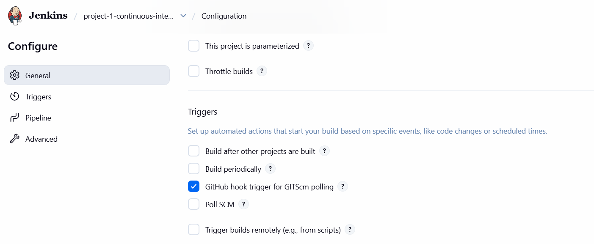
 go to Github repo test 1 - go to seetings - webhooks- add webhooks


If a developer made some chnages in code( for example in index.html- folder webINF) DevOps engineer creates pipeline, pipeline will be automatically triggered, we do not need to click build manually.